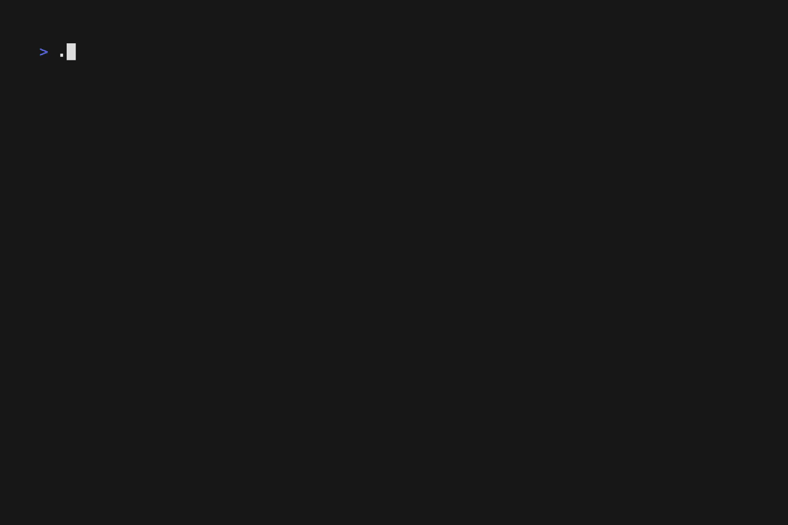

# Card Logger

_NOTE: Currently only Pokémon cards from limited collections are supported._

A tool for managing your card collection.

## Features

### Adding Cards

You can add cards to your collection using the `[A]`dd menu. Use `[enter]` to add the card, or `[ctrl+z]` to undo your change. The syntax is `<collection> <card number> [pattern]`.

You can also optionally enter a `<collection>` first, and just enter `<card number>-[pattern]` after. If pattern is omitted, the default pattern is used.

### Listing Cards

You can list what cards you have using the `[L]`ist menu. You can select a set with `[enter]`. Within a set, you can select a pattern to add with `[a]`, or remove with `[d]`. You can move around using the `[arrow keys]`, or even `[page up]` and `[page down]`. You can also use `[/]` to search for a set or a card.

On the list menu, you can view which cards you are missing using `[m]`. You can move around using the `[arrow keys]`, and use `[/]` to search for a card. You can `[t]`oggle between cards you are completely missing, or cards you have missing patterns for.

### Backups

You can create a backup of your database using the `[B]`ackups menu using the `[s]`ave button, which will be saved in the `./backups` folder. If the tool detects an unsaved change in the user cards, an backup is saved automatically (max 10). You can `[l]`oad a backup by selecting one and pressing `[enter]`.

## Installation

Go to [releases](https://github.com/altugbakan/card-logger/releases) and download the latest release according to your device.

You can select linux for Linux, darwin for Mac, and windows for Windows.

At first, you also need the database, which you can install using the [d]ownload button at the menu. It will download the database from the latest release.
